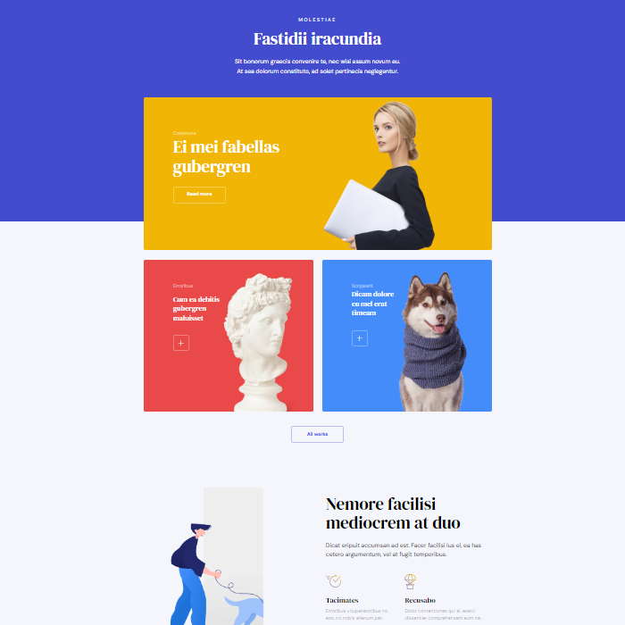

# Posta Uygulaması 

Bu proje Css responsive tasarım öğrenirken öğrendiklerimi pekiştirmek için yaptığım bir projedir.

## Neler Kullandım

- Css divleri düzgün isimlendirme

- Semantik kod yazımı

- Responsive

- Flex kullanımı


  
## Bilgisayarınızda Çalıştırın

Projeyi klonlayın

```bash
  git clone https://github.com/remolg/Posta-app
```

Proje dizinine gidin

```bash
  cd "Posta-app"
```


  
## Ekran Görüntüleri

 
